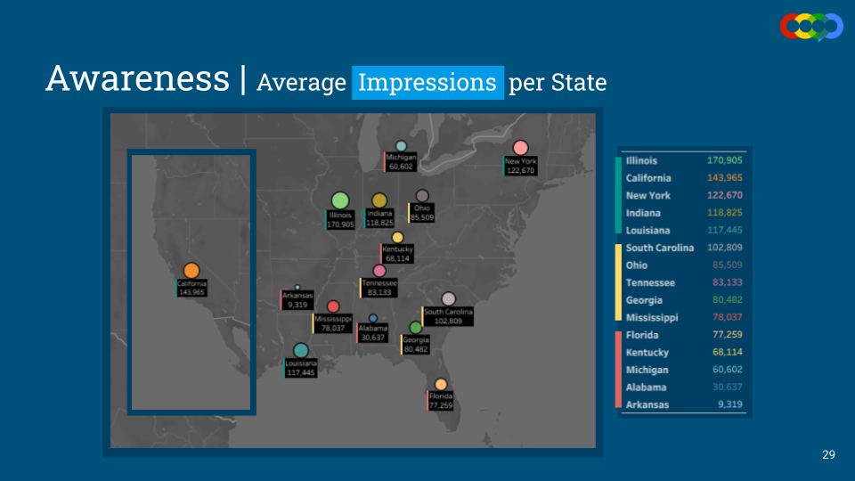
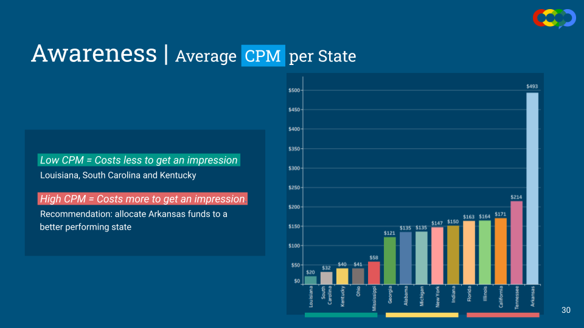
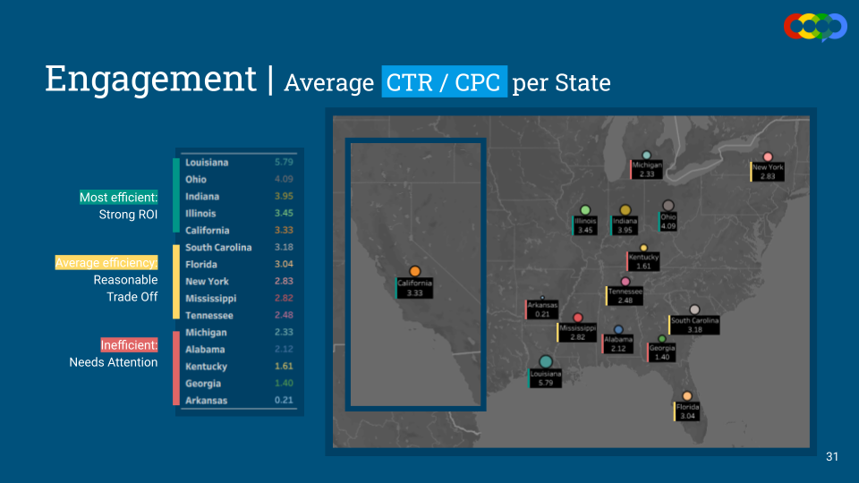
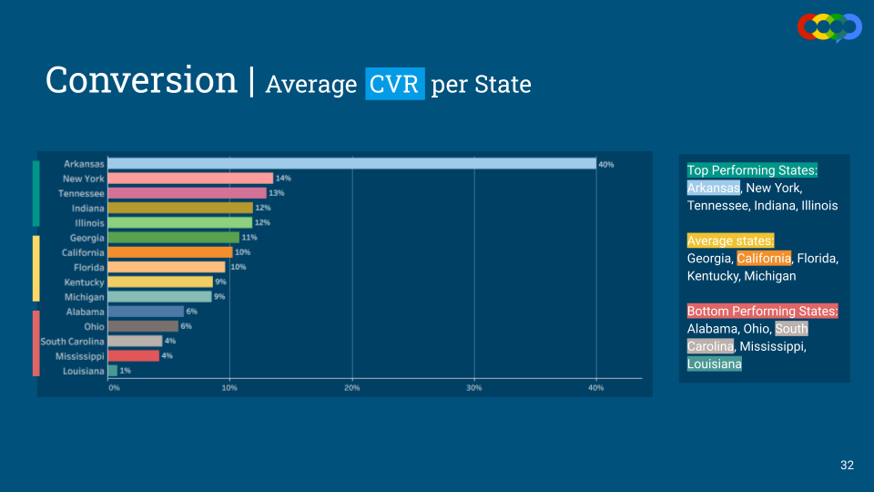
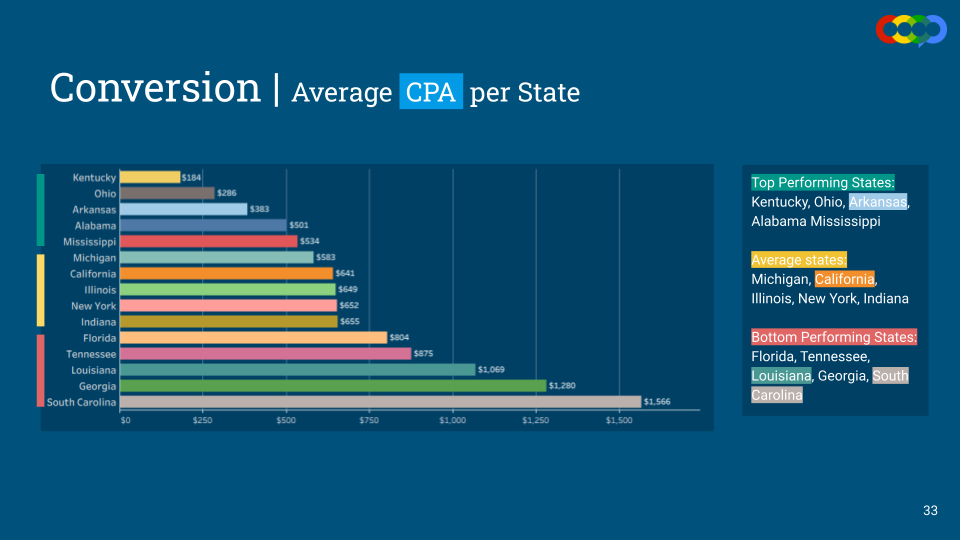

# StratusLink Communications Campaign Performance Analysis  
**COOP Group Project | October 2025- November 2025**  
**Source: Internal Campaign Performance Data**

## 📌 Project Overview
This project analyzes digital advertising campaign performance data for StratusLink Communications to evaluate **regional efficiency, engagement trends, and spend effectiveness** across multiple geographic markets.

We analyzed **700+ campaign performance records**, focusing on key marketing KPIs such as ad spend, engagement, and conversion efficiency to identify high- and low-performing locations.

The analysis was completed as part of a **COOP Group Project (October 2025)**, with an emphasis on translating campaign data into actionable insights for optimization and targeting decisions.

---

## 🛠️ Tools & Techniques
### Data Cleaning & Validation
- **Excel**:  
  - Data standardization and validation across campaign records  
  - Removal of inconsistencies and formatting errors  
  - Pivot tables to aggregate metrics by geography and campaign  
- **Outcome**: Reliable, analysis-ready dataset to support accurate performance reporting.

### Data Analysis & Reporting
- **Excel & Tableau**:  
  - KPI analysis (CTR, CPC, CPA) to assess campaign efficiency  
  - Geographic comparisons to evaluate regional performance variation  
  - Dashboards and spatial reports highlighting high- and low-performing markets

## 📈 Key Visuals
The following visuals summarize key findings and dashboards developed during the analysis.

---

## 📊 Key Insights
- Identified **high-performing regions** delivering strong engagement relative to ad spend.  
- Flagged **underperforming locations** with elevated costs and weaker conversion efficiency.  
- Revealed meaningful **geographic variability in campaign performance**, supporting data-driven targeting and optimization strategies.
